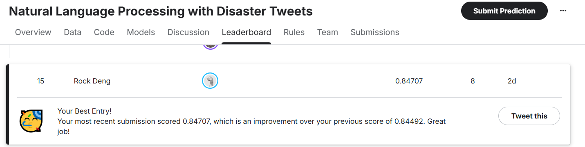

# Natural Language Processing with Disaster Tweets


**A comprehensive NLP project for disaster tweet classification using progressively advanced architectures**

[Competition Link](https://www.kaggle.com/competitions/nlp-getting-started) | [Report Issues](https://github.com/RockDeng110/Natural-Language-Processing-with-Disaster-Tweets/issues)

</div>

---

## 📋 Project Overview

This project tackles the Kaggle **Natural Language Processing with Disaster Tweets** competition. The goal is to predict whether a tweet is about a real disaster (1) or not (0).

### 🎯 Objectives

- Build ML models to classify disaster-related tweets
- Explore multiple NLP architectures from traditional to state-of-the-art
- Learn deep learning, attention mechanisms, and transformer models
- Achieve competitive performance within limited time and resources

### 📊 Dataset

- **Training Set**: 7,613 tweets (labeled)
- **Test Set**: 3,263 tweets (unlabeled)
- **Features**: `id`, `text`, `location`, `keyword`, `target`
- **Evaluation**: F1 Score


---

## 🚀 Quick Start

### 1. Clone Repository

```bash
git clone https://github.com/RockDeng110/Natural-Language-Processing-with-Disaster-Tweets.git
cd Natural-Language-Processing-with-Disaster-Tweets
```


### 3. Download Data

**Option 1: Using Kaggle API**
```bash
kaggle competitions download -c nlp-getting-started
unzip nlp-getting-started.zip -d data/raw/
```

**Option 2: Manual Download**
- Visit [Competition Data Page](https://www.kaggle.com/competitions/nlp-getting-started/data)
- Download `train.csv`, `test.csv`, `sample_submission.csv`
- Place in `data/raw/` directory

**Option 3: download files from google drive**
 - Please refer the code model in the notebook

### 4. Run Notebook

Open and run the notebook in Google Colab.

---

## 📚 Notebook Contents

The notebook contains a complete end-to-end pipeline:

### Section 1: Setup & Configuration
- Import libraries and configure hyperparameters
- Check GPU availability

### Section 2: Data Loading & EDA
- Load training and test data
- Analyze target distribution and text characteristics
- Visualize missing values and text length statistics

### Section 3: Text Preprocessing
- Compare three preprocessing strategies (raw, light, heavy)
- Implement text cleaning pipelines
- Analyze preprocessing impact on vocabulary

### Section 4: Feature Engineering
- Extract text-based features
- Build custom vocabulary
- Implement TF-IDF vectorization

### Section 5: Baseline Model (Traditional ML)
- **Model**: Logistic Regression + TF-IDF
- **Performance**: F1 ≈ 0.768
- Establishes performance baseline

### Section 6: RNN with Attention
- **Architecture**: GRU + Bahdanau Attention
- **Embeddings**: GloVe Twitter 200d
- **Performance**: F1 ≈ 0.758
- Implements custom attention mechanism

### Section 7: Transformer Models
Implements and compares three transformer architectures:

| Model | Parameters | F1 Score |
|-------|-----------|----------|
| **BERT-base** | 110M | 0.8267 |
| **RoBERTa-base** | 125M | 0.8246 |
| **DeBERTa-base** | 86M | 0.8243 |

**Key Features**:
- Keyword enrichment strategy
- 5-fold cross-validation
- Token length optimization
- Performance comparison

### Section 8: Ensemble Strategy
- Weighted ensemble of top transformers
- Grid search for optimal weights and thresholds

### Section 9: Conclusion

### Section 10: Future Work

---


## 🛠️ Technical Stack

- **Languages**: Python 3.8+
- **Deep Learning**: PyTorch, TensorFlow/Keras
- **NLP Libraries**: Transformers (Hugging Face), NLTK
- **ML Libraries**: scikit-learn, pandas, numpy
- **Visualization**: matplotlib, seaborn
- **Development**: Google Colab


---

## 📚 Resources

### Useful References

- [Kaggle Competition](https://www.kaggle.com/competitions/nlp-getting-started)
- [Understanding LSTMs](http://colah.github.io/posts/2015-08-Understanding-LSTMs/) - Chris Olah
- [The Illustrated BERT](http://jalammar.github.io/illustrated-bert/) - Jay Alammar
- [Hugging Face Transformers](https://huggingface.co/docs/transformers/)

### Papers

- [Attention Is All You Need](https://arxiv.org/abs/1706.03762) - Transformers
- [BERT](https://arxiv.org/abs/1810.04805) - Pre-trained Language Representations
- [RoBERTa](https://arxiv.org/abs/1907.11692) - Optimized BERT Pretraining
- [DeBERTa](https://arxiv.org/abs/2006.03654) - Disentangled Attention

---


## 📊 Kaggle Competition Results

**Competition**: [Natural Language Processing with Disaster Tweets](https://www.kaggle.com/competitions/nlp-getting-started)

**Final Score**: *0.84707*

**Leaderboard Position**: *15*

